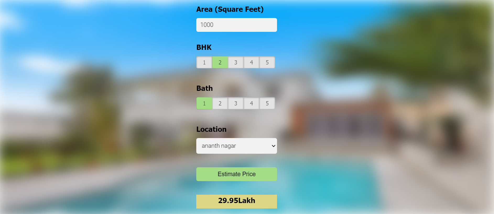

# Bangalore Home Price Prediction

A comprehensive machine learning project aimed at predicting home prices in Bangalore. Deployed on an AWS EC2 instance, this project showcases a full-stack application from data preprocessing to a user-friendly web interface for real-time predictions.

## Overview

This project encapsulates the end-to-end process of developing a predictive model, focusing on the data science pipeline including data cleaning, feature engineering, model selection, and deployment. The Flask-based web application allows users to estimate property prices based on various input parameters.

## Key Features

- **Data Preprocessing**: Comprehensive data cleaning and manipulation to handle missing values, remove outliers, and convert non-numeric to numeric data.
- **Feature Engineering**: Extraction and selection of relevant features, creation of new features to improve model accuracy.
- **Model Building**: Utilization of Linear Regression as the core predictive model due to its interpretability and efficiency.
- **Model Evaluation**: Application of cross-validation and GridSearchCV to fine-tune model parameters and ensure robustness.
- **Deployment**: Flask server for API handling and Nginx as a reverse proxy for deployment on an AWS EC2 instance.

## Machine Learning Pipeline

- **Data Cleaning**: Removed irrelevant features, handled missing values, and cleaned anomalies to ensure high-quality data.
- **Feature Engineering**: Analyzed various features such as total square feet, number of bedrooms (BHK), and bathrooms to create a comprehensive feature set.
- **Outlier Detection**: Implemented strategies to detect and remove outliers, ensuring the model's generalizability.
- **Model Selection and Tuning**: Linear Regression was chosen for its simplicity and interpretability. Employed GridSearchCV for hyperparameter tuning and cross-validation for model evaluation, ensuring the selection of a robust model.
- **Deployment**: Model serialized using pickle, with Flask serving the backend and Nginx as the reverse proxy for efficient request handling.

## Technologies Used

- **Data Science**: Python, Pandas, NumPy, Scikit-learn
- **Web Development**: HTML, CSS, JavaScript (jQuery)
- **Back-end**: Flask
- **Deployment**: AWS EC2, Nginx

## Interface Snapshot

The snapshot above showcases the intuitive user interface of the Bangalore Home Price Prediction application. Users can easily input the desired square footage, select the number of bedrooms (BHK), bathrooms, and choose from a list of predefined locations. With a simple click on the "Estimate Price" button, the application provides a real-time prediction of the property's price, displayed in a clear and engaging format. The interface is designed to provide a seamless experience, offering both functionality and aesthetic appeal, to ensure user engagement and accurate estimations.

